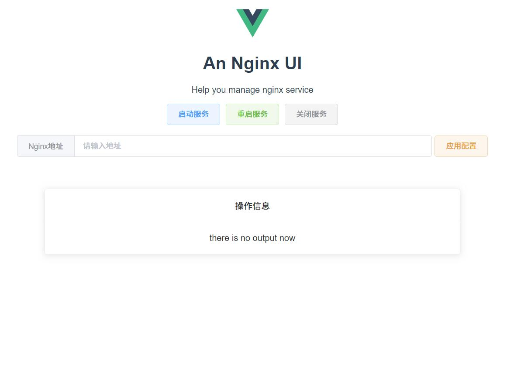

# nginxui
a simple nginx ui for windows

一个基于flask设计的windows平台的nginx图形化工具

## 使用

```bash
git  clone https://github.com/Landers1037/nginxui.git
```

在nginx路径栏输入当前nginx安装的目录，例如`d:\nginx`

在nginx下的conf目录下先配置好需要监听的端口和文件

双击路径下的`app.exe`会自动打开web图形化页面



点击启动 启动nginx服务

点击重启 在修改conf文件后重启服务

点击关闭 停止后台运行的nginx服务

### 错误提示

当前运行的任务有错误时会有alert提示框提醒

### 运行端口

默认的app .exe运行在5000端口请保持5000端口未被占用

### 退出

在**app.exe**的终端里按下`CTRL+C`或者直接关闭**app.exe**